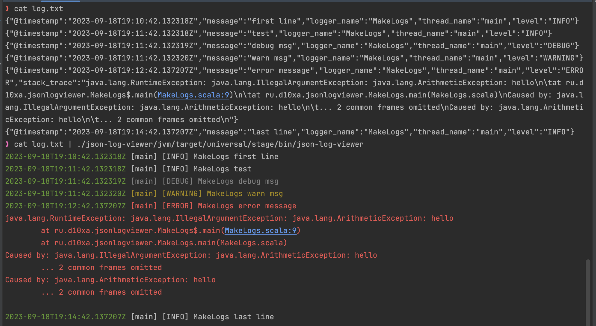

# json-log-viewer

[)](https://search.maven.org/artifact/ru.d10xa/json-log-viewer_2.12)
[)](https://search.maven.org/artifact/ru.d10xa/json-log-viewer_3)


The `json-log-viewer` converts JSON logs to a human-readable
format via stdin and offers a Scala.js browser version,
streamlining log analysis for developers and system administrators.

[DEMO](https://d10xa.ru/json-log-viewer/)



## install

```
coursier install json-log-viewer --channel https://git.io/JvV0g
```

## build jvm version

```
sbt stage
```

## run jvm version

```
cat log.txt | ./json-log-viewer/jvm/target/universal/stage/bin/json-log-viewer
```

## build js version

```
sbt fullLinkJS
```

## run js version

```
cat log.txt | node ./json-log-viewer/js/target/scala-3.3.1/json-log-viewer-opt/main.js
```

# frontend-laminar

```~fastOptJS::webpack```

# k9s plugin

Integrate json-log-viewer with k9s to view formatted JSON logs directly within the k9s interface.

Add the following to your k9s plugin file 
(usually located at ~/.k9s/pluginы.yaml or, on macOS, check the plugin path with `k9s info`):

```yaml
plugins:
  json-log-viewer:
    shortCut: Ctrl-L
    description: "json-log-viewer"
    scopes:
      - pod
      - containers
    command: sh
    background: false
    args:
      - -c
      - |
        if [ -n "$CONTAINER" ]; then
          kubectl logs $POD -n $NAMESPACE --context $CONTEXT -c $CONTAINER -f --tail 500 | json-log-viewer; read -p "Press [Enter] to close..."
        else
          kubectl logs $NAME -n $NAMESPACE --context $CONTEXT -f --tail 500 | json-log-viewer; read -p "Press [Enter] to close..."
        fi
```

##  k9s plugin usage

1. Install json-log-viewer
2. Launch k9s
3. Select a Pod or Container
4. Press Ctrl+L to view logs formatted by json-log-viewer
